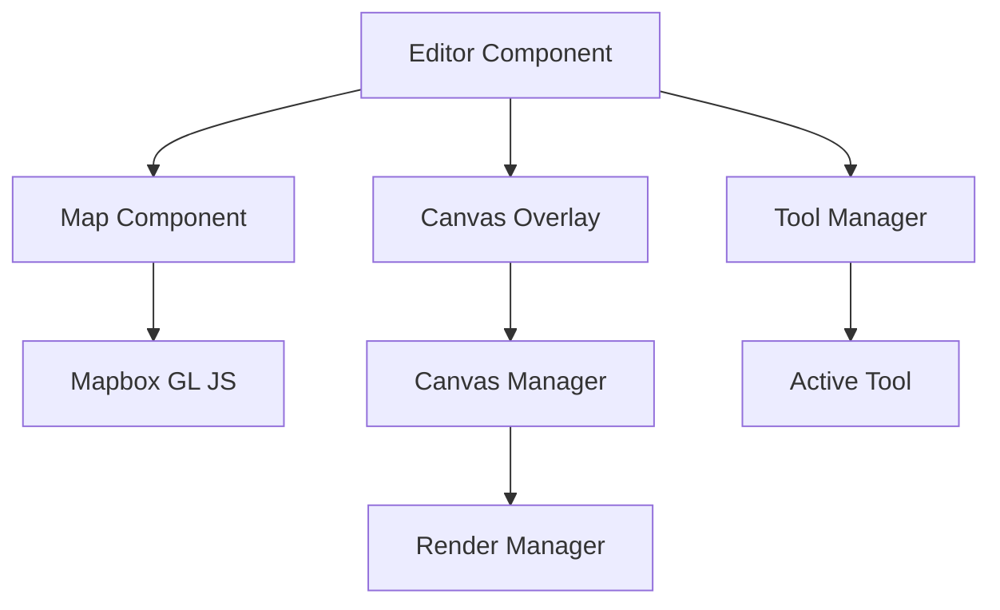
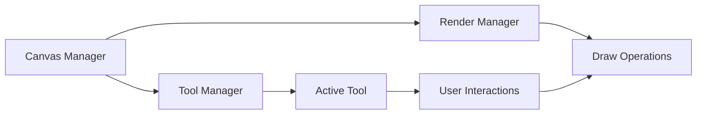
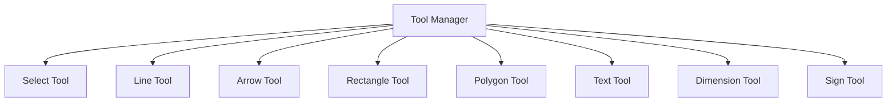
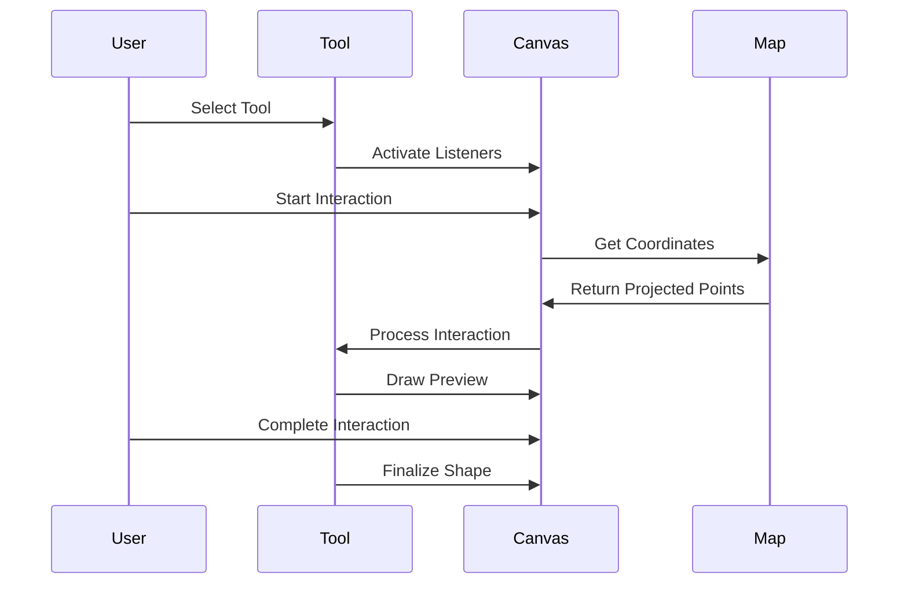

# MuniCAD Application Logic Flow

## Core Architecture



## Component Hierarchy

1. **Editor Component** (`src/components/create/Editor.tsx`)
   - Main container component
   - Manages application state
   - Coordinates between Map, Canvas, and Tools

2. **Map Component** (`src/components/create/Map.tsx`)
   - Renders Mapbox GL map
   - Handles map interactions
   - Provides base layer for annotations

3. **Canvas Overlay**
   - Transparent HTML5 Canvas element
   - Positioned absolutely over map
   - Handles all drawing operations

## Canvas System

### Canvas Manager (`src/components/create/canvas/CanvasManager.ts`)


Responsibilities:
- Initializes canvas context
- Manages canvas size and scaling
- Coordinates between tools and rendering
- Handles window resize events
- Maintains drawing state

### Render Manager (`src/components/create/canvas/RenderManager.ts`)
- Manages rendering queue
- Handles shape drawing operations
- Optimizes redraw cycles
- Maintains z-index ordering

## Tool System

### Tool Manager (`src/components/create/tools/ToolManager.ts`)


Each tool inherits from `BaseTool` and implements:
- `activate()`: Setup tool event listeners
- `deactivate()`: Cleanup tool event listeners
- `redraw()`: Handle tool-specific rendering

### Tool Interaction Flow


## Event System

### Event Manager (`src/components/create/tools/EventManager.ts`)
- Centralized event bus
- Handles tool communication
- Manages shape updates
- Coordinates between components

Key Events:
1. `SHAPE_COMPLETE`: New shape created
2. `SELECTION_CHANGE`: Shape selected/deselected
3. `SHAPE_MOVE`: Shape position updated
4. `SHAPE_UPDATE`: Shape properties modified
5. `MAP_CHANGED`: Map view changed

## Drawing Process

1. **User Interaction**
   ```mermaid
   graph LR
       A[User Click] --> B[Tool Handler]
       B --> C[Get Map Coordinates]
       C --> D[Create Shape]
       D --> E[Draw Preview]
       E --> F[Complete Shape]
   ```

2. **Shape Management**
   ```mermaid
   graph TD
       A[Shape Created] --> B[Add to State]
       B --> C[Update Canvas]
       C --> D[Emit Events]
       D --> E[Update UI]
   ```

## Tool-specific Behaviors

### Selection Tool
- Handles shape selection
- Manages resize handles
- Processes drag operations
- Updates shape properties

### Drawing Tools
- Line Tool: Single line segments
- Arrow Tool: Lines with arrow heads
- Rectangle Tool: Four-sided shapes
- Polygon Tool: Multi-point shapes
- Text Tool: Text annotations
- Dimension Tool: Measurement lines
- Sign Tool: Traffic sign placement

## Optimization Techniques

1. **Render Optimization**
   - Request Animation Frame
   - Render queue
   - Selective updates
   - Canvas clearing optimization

2. **Event Optimization**
   - Debounced listeners
   - Event delegation
   - Cached calculations
   - Batched updates

## State Management

1. **Application State**
   - Current tool
   - Selected shape
   - View settings
   - UI configuration

2. **Shape State**
   - Shape collection
   - Shape properties
   - Selection state
   - Temporary states

## Integration Points

1. **Map Integration**
   - Coordinate conversion
   - View state sync
   - Event handling
   - Layer management

2. **Tool Integration**
   - Event handling
   - State management
   - UI updates
   - Shape creation

This documentation provides a comprehensive overview of the application's architecture and logic flow, focusing on the interaction between the map, canvas overlay, and tools system.